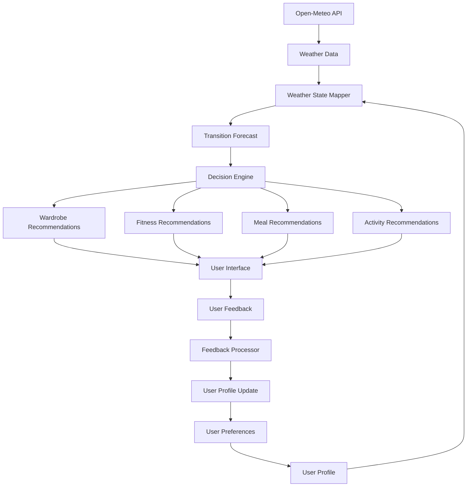
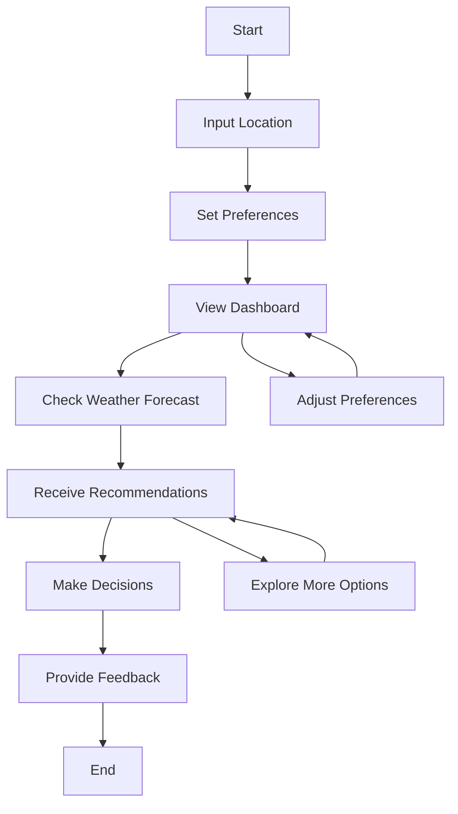
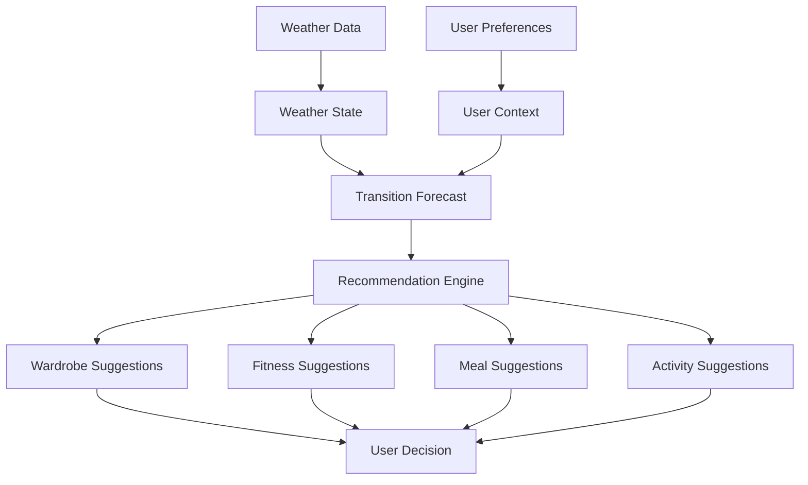
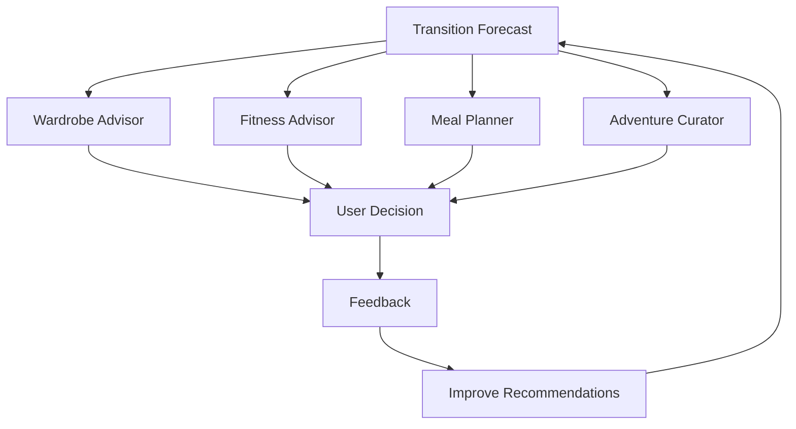
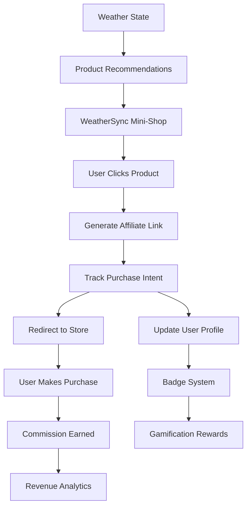
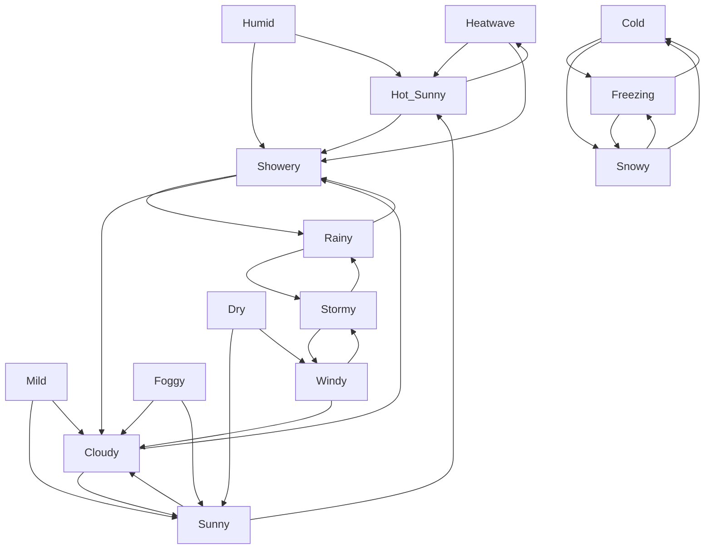
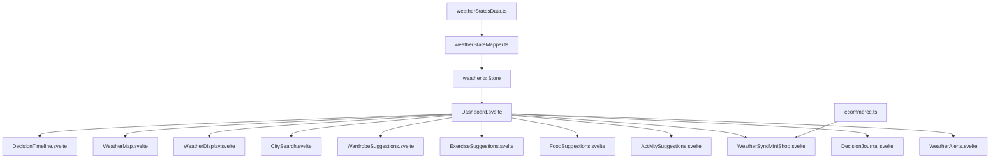
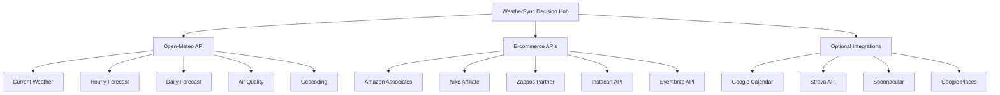
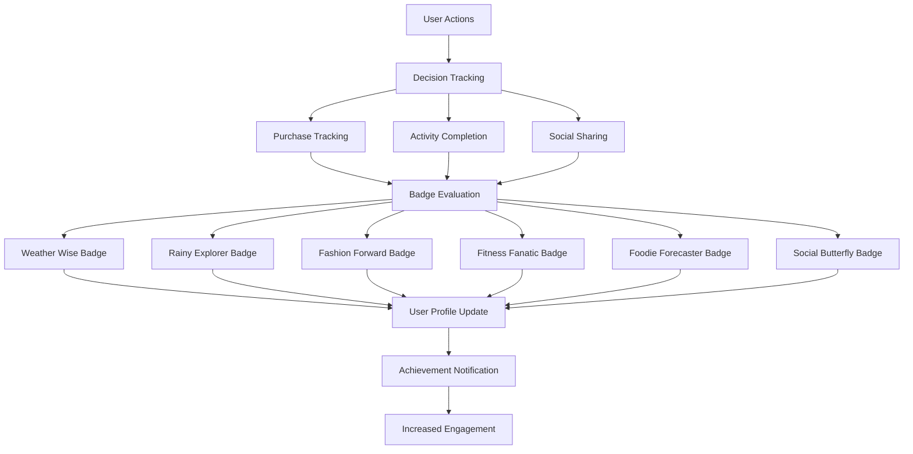
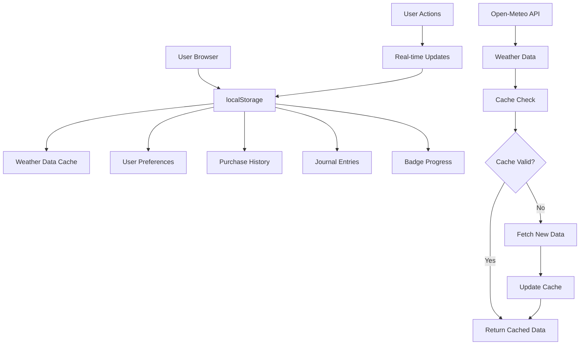

# WeatherSync Decision Hub - Architecture Documentation

This document contains the Mermaid diagrams that visualize the key aspects of the WeatherSync Decision Hub system as specified in the PRD.

## System Architecture Diagram

Illustrates how user inputs, Open-Meteo data, and YAML transitions interact within the Decision Hub to generate recommendations.

```mermaid
graph TD
    A[User] --> B[Input Location/Preferences]
    B --> C[Weather Data Fetch (Open-Meteo API)]
    C --> D[Weather State Mapping (YAML)]
    D --> E[Transition Forecast]
    E --> F[Decision Hub]
    F --> G[Wardrobe Advisor]
    F --> H[Fitness Advisor]
    F --> I[Meal Planner]
    F --> J[Adventure Curator]
    G --> K[Clothing Recommendations]
    H --> L[Fitness Recommendations]
    I --> M[Meal Recommendations]
    J --> N[Activity Recommendations]
    K --> O[User Decision]
    L --> O
    M --> O
    N --> O
    O --> P[Feedback Loop]
    P --> A
```

## Data Flow Diagram

Shows how weather data and user preferences are processed to generate recommendations, with feedback improving future outputs.



## User Workflow Diagram

Depicts the user's interaction with the Hub, from setup to decision-making.



## Decision-Making Process Diagram

Illustrates how weather data and user context drive recommendations.



## Feature Interactions Diagram

Shows how features collaborate to provide a cohesive experience.



## E-commerce Integration Flow

Visualizes the e-commerce integration and purchase tracking system.



## Weather State Transition System

Shows the 16 weather states and their transition relationships.



## Component Architecture

Shows the relationship between UI components in the application.



## API Integration Architecture

Illustrates the integration with external APIs and services.



## Gamification System

Shows the badge system and user engagement mechanics.



## Data Storage and Caching

Visualizes the data persistence and caching strategy.



---

These diagrams provide a comprehensive visual overview of the WeatherSync Decision Hub architecture, helping developers understand the system's structure, data flow, and component interactions as specified in the Product Requirements Document. 