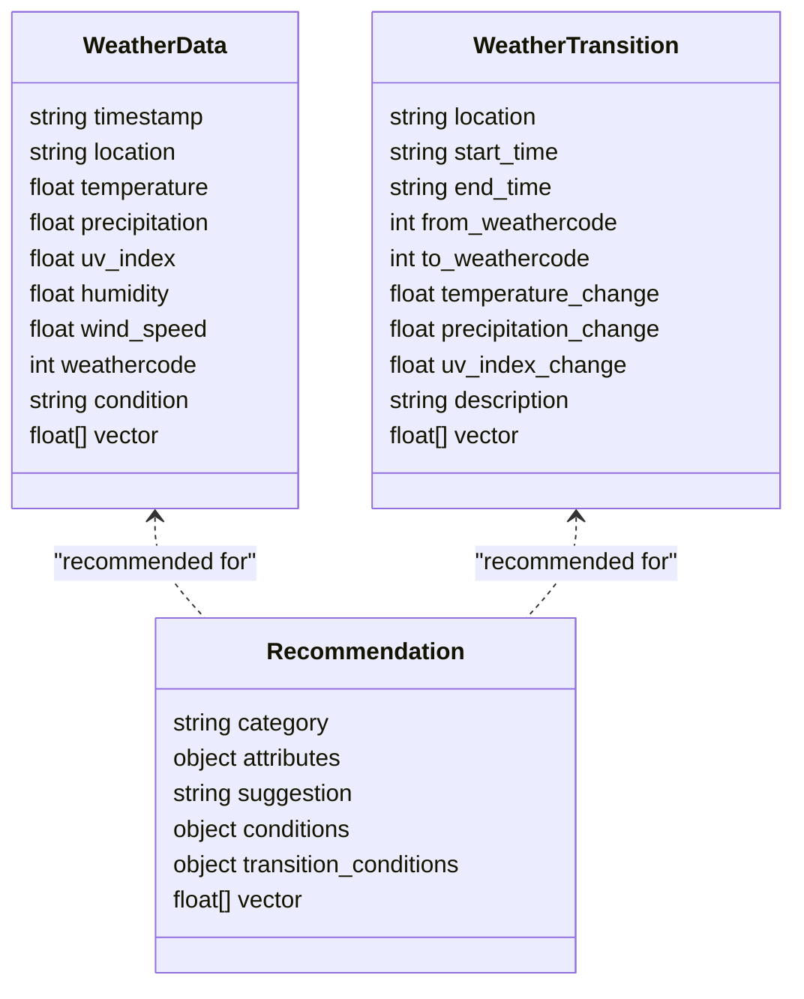
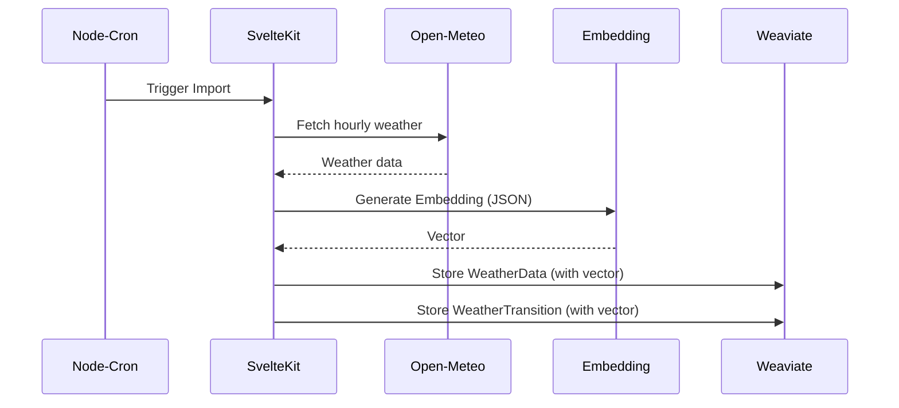
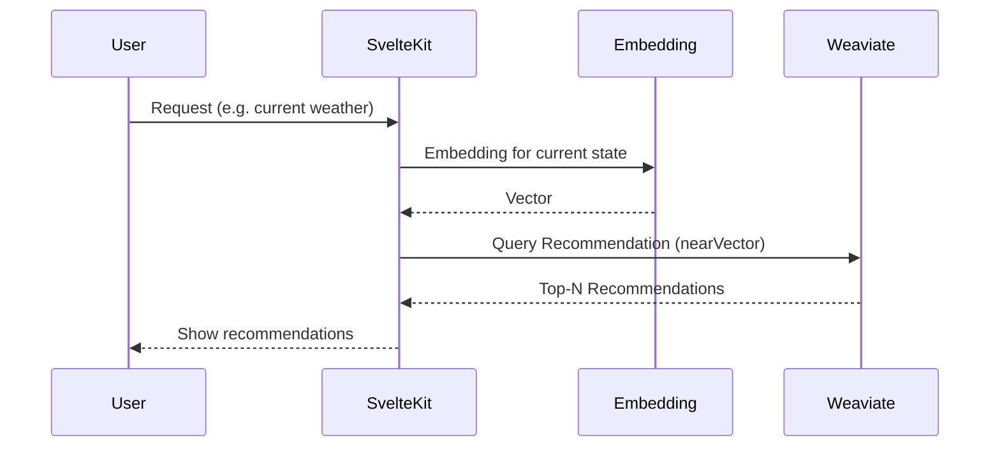
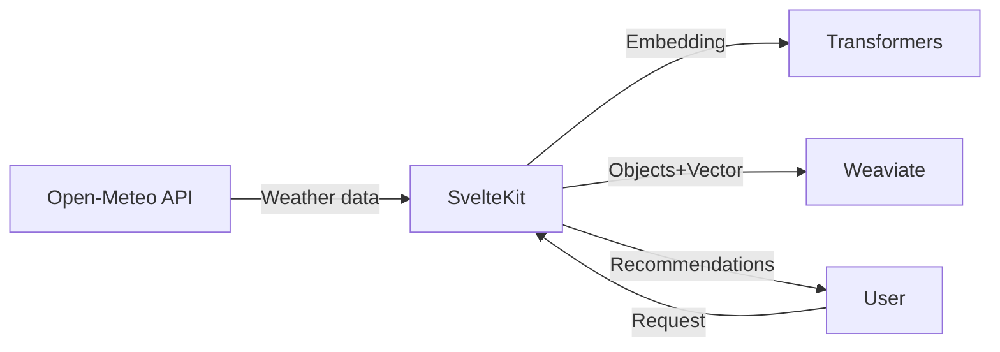
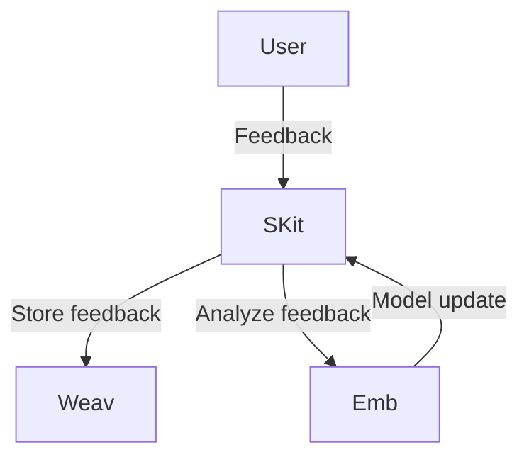
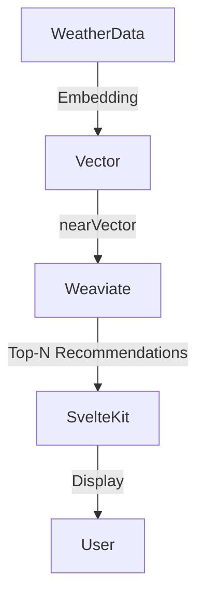

# Weather Recommendation System – Architecture

## 1. System Overview

```mermaid
flowchart TD
    User[User (Browser)]
    SvelteKit[SvelteKit Frontend/Backend]
    OpenMeteo[Open-Meteo API]
    Weaviate[Weaviate Vector Database]
    Embeddings[Transformers Embedding (Xenova)]
    S3[(S3/Cloud Storage)]
    Cron[Node-Cron Importer]

    User <--> |HTTP| SvelteKit
    SvelteKit <--> |REST| OpenMeteo
    SvelteKit <--> |REST| Weaviate
    SvelteKit <--> |local| Embeddings
    Cron --> |Batch| SvelteKit
    SvelteKit <--> |Assets| S3
```

---

## 2. Components & Responsibilities

| Component         | Responsibility                                                        |
|-------------------|-----------------------------------------------------------------------|
| **SvelteKit**     | Frontend, API routing, user interaction, recommendation & i18n logic    |
| **Open-Meteo**    | Weather data (hourly, daily, historical)                              |
| **Weaviate**      | Storage & semantic search for weather data, transitions, recommendations|
| **Embeddings**    | Converts weather data/recommendations to vectors (MiniLM, Xenova)      |
| **Node-Cron**     | Scheduled import of weather data/transitions                          |
| **S3/Cloud**      | (Optional) Storage for assets, backups                                |

---

## 3. Data Model (Mermaid Class Diagram)



---

## 4. Weather Data Import (Sequence Diagram)



---

## 5. Recommendation Query (Sequence Diagram)



---

## 6. Data Flow Diagram



---

## 7. Deployment Architecture

```mermaid
graph TD
    subgraph Cloud/Server
        SKit[SvelteKit (Node.js)]
        Weav[Weaviate (Docker)]
        Emb[Transformers (Node.js)]
        Cron[Node-Cron]
    end
    User[User (Browser)] --> SKit
    SKit <--> Weav
    SKit <--> Emb
    Cron --> SKit
    SKit <--> OM[Open-Meteo API]
```

---

## 8. Extensibility & AI Feedback



---

## 9. Example: Recommendation Query (Mermaid Pseudocode)



---

## 10. Summary (2025-05 Update)

* **SvelteKit** bleibt zentrales UI- und API-Gateway – jetzt mit integriertem **i18n-Layer** (🇩🇪/🇺🇸) und zufallsbasierten Textbausteinen.
* **Weaviate** speichert Wetterdaten und Vektor-Embeddings für semantische Recommendations.
* **Embeddings** (MiniLM/Xenova) liefern near-vector-Suche.
* **Open-Meteo** bleibt Datenquelle ohne API-Key.
* **Recommendation-Engine**: Kategorien auf **Wardrobe, Food, Activity** reduziert. Jede Kategorie liefert  
  – einen wetterabhängigen Vorschlag  
  – kreativen E-Commerce-Call-to-Action (Affiliate)  
  – Activity liefert immer zwei Ideen (aktiv & gemütlich-knifflig).
* **Node-Cron** automatisiert Imports; System modular & erweiterbar für neue Kategorien oder Sprachen.

---

## 11. UI Night Mode & Accessibility (2025-05 Update)
- The UI automatically switches between day and night mode based on the selected location's sunrise/sunset and timezone.
- Weather icons visually reflect day/night at the location.
- Manual override is respected (toggle sets override, double-click clears).
- All interactive elements are accessible (keyboard, ARIA, focus states).
- All new features are covered by tests (store, util, and integration).
- The Smart Activity Planner feature/component has been removed from the dashboard and codebase per user request.

---

**Tip:**
You can visualize the Mermaid diagrams directly in Markdown viewers, VSCode plugins, or on [mermaid.live](https://mermaid.live/).

If you need a specific detail diagram (e.g. only recommendation flow, only data model, etc.) or a German version, just ask! 